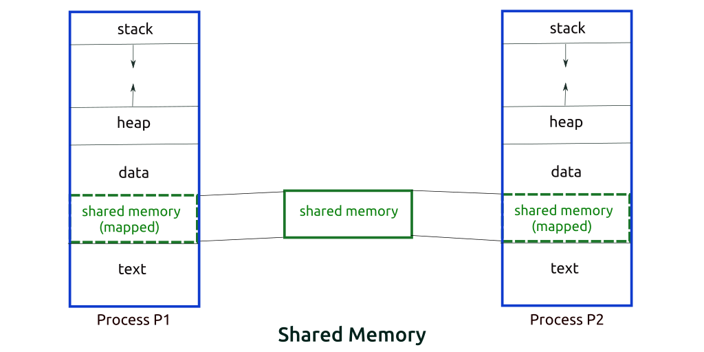
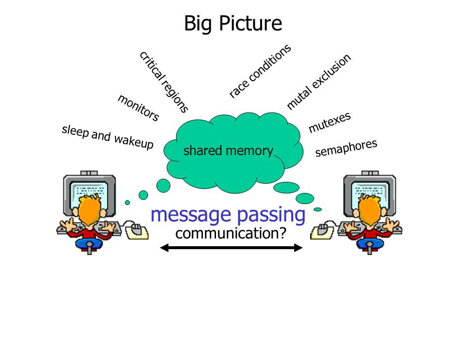

Синхронизация процессов и потоков
========================

Межпроцессная коммуникация (IPC) – это механизм, который позволяет процессам взаимодействовать друг с другом и синхронизировать действия. Связь между этими процессами может рассматриваться как сотрудничество.

Процессы могут взаимодействовать двумя способами: через общую [память](%D0%9F%D0%B0%D0%BC%D1%8F%D1%82%D1%8C%2F%D0%A3%D0%BF%D1%80%D0%B0%D0%B2%D0%BB%D0%B5%D0%BD%D0%B8%D0%B5%20%D0%BF%D0%B0%D0%BC%D1%8F%D1%82%D1%8C%D1%8E.md) или через передачу сообщений.

## Метод использования общей памяти
Допустим, есть два процесса: исполнитель (производитель) и потребитель. Один производит некоторый товар, а второй его потребляет. Эти два процесса имеют общее пространство или ячейку памяти, известную как «буфер». Там хранится элемент, созданный исполнителем, оттуда же потребитель получает этот элемент.

Однако у этих версий есть как минимум две значимые проблемы: первая известна как проблема безграничного буфера: исполнитель может продолжать создавать элементы без ограничений на размер буфера. Вторая заключается в том, что исполнитель, заполнив буфер, переходит в режим ожидания.

В задаче с ограниченным буфером у исполнителя и потребителя будет общая память. Если общее количество произведенных товаров равно размеру буфера, то исполнитель будет ждать их потребления.

Аналогично потребитель сначала проверит наличие товара, и если ни один элемент не будет доступен, придётся ждать его освобождения.

## Метод анализа сообщений
С помощью этого метода процессы взаимодействуют друг с другом без использования общей памяти. Допустим, есть два процесса, p1 и p2, которые хотят взаимодействовать друг с другом. Они работают следующим образом:

- Устанавливается связь (если её ещё не существует).
- Начинается обмен сообщениями с помощью базовых примитивов. Нам нужно как минимум два примитива – отправить (сообщение, пункт назначения) или получить (сообщение).

Размер сообщения может быть фиксированным или переменным. Проектировщикам ОС проще работать с сообщениями фиксированного размера, а программистам – переменного. Стандартное сообщение состоит из двух частей – заголовка и тела.