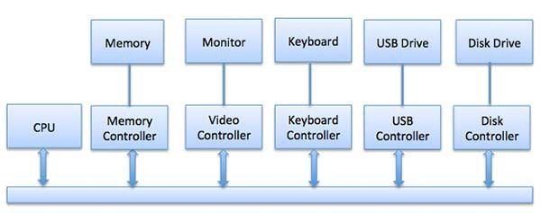

Управление вводом-выводом
========================

Одной из важнейших задач операционной системы является управление различными устройствами ввода и вывода вроде мыши, клавиатуры, дисководов, etc.

Система ввода и вывода принимает запрос приложения на ввод или вывод данных, а затем отправляет его на соответствующее физическое устройство. После возвращает приложению полученный ответ. Устройства ввода и вывода можно разделить на две категории:

- Блочные: то есть устройства, с которыми драйверы связываются, отправляя целые блоки данных. Например, жесткие диски, USB-камеры, Disk-On-Key.
- Символьные: те устройства, с которыми драйвер связывается, отправляя и получая одиночные символы (байты или октеты). Например, последовательные порты, параллельные порты, звуковые карты и так далее.

ЦПУ должен иметь способ передачи информации на устройство ввода-вывода и обратно. И есть три способа сделать это:
1. Специальные инструкции
    
    Особые, неуниверсальные инструкции процессора, внедренные специально для контроля устройств ввода-вывода. Они позволяют отправлять данные на устройство и считывать их оттуда.

2. Входы и выходы с отображением памяти

    Когда используется ввод-вывод с отображением памяти, одно и то же адресное пространство разделяется памятью и устройствами ввода-вывода. Устройство подключается непосредственно к ячейкам памяти так, чтобы можно было передавать блок данных без применения ЦПУ.
    
    

3. Прямой доступ к памяти (DMA)

    Медленные устройства, такие как клавиатуры, генерируют прерывания ЦПУ после передачи каждого байта. Если бы быстрые устройства работали похожим образом, то ОС бы тратила большую часть времени впустую, на обработку этих прерываний. Поэтому для снижения нагрузки обычно используется прямой доступ к памяти (DMA).
    
    Это означает, что ЦПУ предоставляет модулю ввода и вывода полномочия для чтения или записи в память. Сам модуль управляет обменом данными между основной памятью и устройством ввода-вывода. ЦПУ участвует в начале и конце передачи, а прерывается только после полной передачи блока.
    
    Организация прямого доступа к памяти требует специального оборудования, называемого контроллером DMA (DMAC). Он управляет передачей данных и доступом к системной шине. Контроллеры запрограммированы с указателями источника и места назначения, счетчиками для отслеживания количества переданных байтов и прочими настройками.