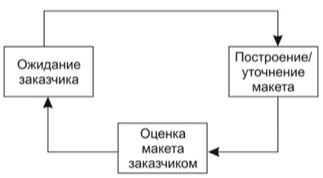

Модели жизненного цикла проекта
========================

### Водопадная модель

Переход к следующему этапу только после завершения предыдущего. Подходит для небольших проектов и если требуется много документации.

Достоинства: 
- план и временной график по всем этапам
- упорядочивание этапов
- Полнота документациии

Недостатки:
- Недостаточно адаптивен для изменений
- требуется точная формулировка, что редко возможно
- Результат доступен только в конце разработки
- Высокий риск

#### Макетирование
Построение модели и вытягивание требований из заказчика для снятия неопределенностей.
- бумажный макет или на основе ПК
- работающий макет
- существующая программа

### Спиральная модель

Достоинства:
- Наиболее реально отображает модель разработки
- Учитывает риски
- Позволяет остановить проект если слишком большие риски
- 

Недостатки:
- Требуется много внимания заказчика
- Плохо планируется время разработки

### Компонентно ориентированная модель

Разработка должна строится на использовании уже существующих модулях. Является модификацией спиральной модели.

Достоинства:
- Уменьшение стоимости разработки
- Увеличение производительности

Недостатки:

### Инекрементна модель
Последовательность водопадных моделей. Порождающих новые версии. Экстремальное программирование. Получаем небольшие приращения в важном функционале.

