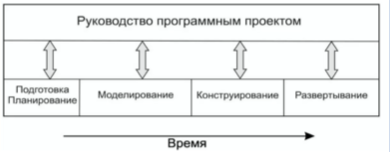
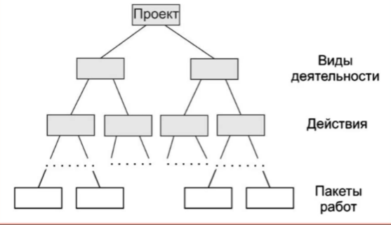
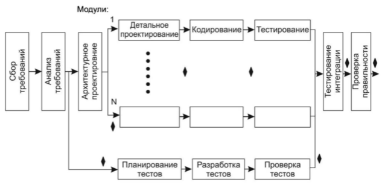
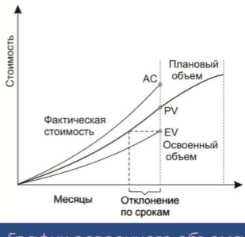
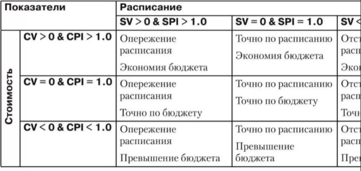
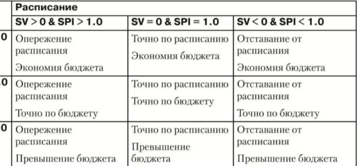

Руководство програмным проектом
========================

Руководство является защитной деятельностью производства программы.

Руководство применяется ко всем четырем "П": Персоналу(тем кто делает), процессу(порядку в котором делается), проекту(среда в ктоторой делается), продукту(итогу всех дел).

Цель любого проекта производство продукта.

## Характерные точки управления проектом
### Начало проекта
- Следует установить цели  (определяется разработчиком и заказчиком)
- проблемную область проекта (установка нужных функций ПО, границ и характеристик)
- установить ограничения
- обсудить альтернативные решения

### Измерения, меры и метрики
Позволяют понять как изменяется проект. Из измерений выводятся меры, а по ним состовляют метрики. Это позволяет в числовом виде определения изменений.

### Характерные точки управления проектом
Процесс оценки - Необходимо измерить трудозатраты (в человекомесяцах), продолжительность (в днях), стоимость (в деньгах). При оценке обычно исходят из прошлого опыта. Если прошлого опыта нет, то нужно изучать способы оценки. НЕобходимо соотнносить текущие ресурсы.

[Анализ риска](%D0%A3%D0%BF%D1%80%D0%B0%D0%B2%D0%BB%D0%B5%D0%BD%D0%B8%D0%B5%20%D1%80%D0%B8%D1%81%D0%BA%D0%B0%D0%BC%D0%B8.md) - Анализ области риска в вопросах влияния на проект. Есть ли трудность в реализации ПО, нет ли скрытых проблем. Позволяет прийти к выводу о необходимости реализации продукта. 

Планирование - Очень важная часть, так как является этапом анализа и может помочь предвосхитить все проблемные моменты как с точки зрения людских, денежных, временных ресурсов. Требуется построения графика задач. Так же возможно перепланирование при изменении окружения, например изменение требований заказчика. Возможно пересогласование плана с заказчиком.

Трассировка и контроль - Каждая задача в плане так же отслеживается руководителем проекта. За счет отметок времени получется правильно перепланировать и переставить важные вехи. 

## Иерархическая структура работ

Работа декомпозируетс до тех пор пока не достигнет уровня пакета работ(низшего). Пакеты назначаются на исполнителей. Надо делать пакеты так, что бы при сворачивании пакетов не должно ничего быть потеряно.

Согласно PMBOK гарантия включения в проект всех работ.

## Составление графика работ прогресса проекта
Сначала собираются требования. Потом по ним формируются задачи и в итоге составляется сетевая диаграмма работ проекта.

После анализа можно уточнить требуемые характеристики продукта, обозначить интерфейс, ограничения, работу с данными, формы представления информации.

Ромбиками на схеме обозначенны вехи. Желательно распределять равномерно. 

Менеджер проекта долэен знать задачи критический путь и критические задачи. 

Основная меры это достижение вех во временном анализе.

Следующий блок пока не выполнены все предшетсвующие. У каждого номера дожен быть свой номер модуля. Петель быть не может.

Есть три категории:
- Предшетствующие - Операции которые надо завершить до выбранной.
- Последующая - Операции которые надо после до выбранной.
- Параллельная - Операции можно делать совместно с выбранной.

## Рекомедуемое правило распределения 40-20-40

- 40 % времени на анализ затрат (высокаянагрузка из-за высокой неопределенности)
- 20 % на кодирование (кодирование хорошо проработанных проектных решений не сложен, теоретически. Планирование переходит на стратегическом уровне)
- 40 % на тестирование и отладку (Сложность обусловлена с работой методом проб и ошибок)

## Контроль кода програмного проекта освоенного объема
Позволяет оценить процент сделанного и несделанного, что позволяет пересчитать расписание и стоимость.
Используется EVM(Earned Value Managment):
- Освоенный объем (Earned Value) - Плановая стоимость выполненных работ
- Плановый объем (Planned Value) - Плановая стоимость запланированнная к текущему моменту
- Запланированный объем (Scheduled Value) - Запланированный объем к текущему моменту

Надо учитывать что данная метрика не учитывает вес критического пути.

Возможные варианты значений

Позволяет делать прогноз денежных затрат.

