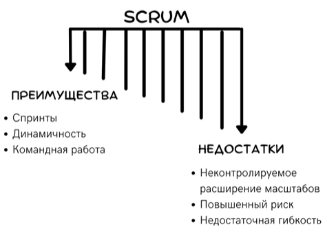
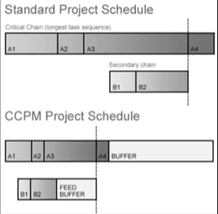
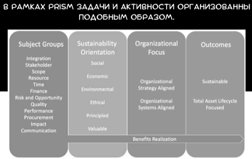
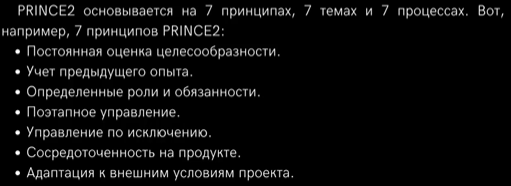

Управление IT-проектами
========================
## Тяжеловесные и легковесные процессы
### Тяжеловесные
Для управления проектами сначала были разработаны тяжеловесные проекты. Они строго расписывали требования к ПО и не всегда могли учесть погрешность и внешние факторы. А так же порождали требования к огромному числу документации на всех этапах. 

Достоинства:
- Расчитаны на среднюю квалификацию исполнителей
- Большая специализация исполнителей
- низкое требование к стабильности команды
- отсутсвие ограничений по сложности проекта

Недостатки:
- Большая надстройка по управлению
- Длительные стадии [ЖЦ](%D0%9C%D0%BE%D0%B4%D0%B5%D0%BB%D0%B8%20%D0%B6%D0%B8%D0%B7%D0%BD%D0%B5%D0%BD%D0%BD%D0%BE%D0%B3%D0%BE%20%D1%86%D0%B8%D0%BA%D0%BB%D0%B0%20%D0%BF%D1%80%D0%BE%D0%B5%D0%BA%D1%82%D0%B0.md)
- формализованные коммуникации

### Легковесные
В ответ на это появились легкие(гибкие) процессы. Они предлагали компромис между требованиями, строгостью и адаптивностью. Они позволили снизить требуемые объемы документации. Реагировать легче наизменение требований от заказчика. 

Достоинства:
- Снижение расходов на управление
- Совмещение ролей
- Упрощение стадий анализа и проектирования
- неформальные коммуникации

Недостатки: 
- Требуется более универсальная, стабильная команда
- Более узкая специализация команды
- Объем и сложность ограничены

## Бережливая разработка ПО
Рассматривает гибкие методы в качестве эффективных. Он раскрывает возможностиразвития гибких методов:
- Позволяет держать под контролем всю цепочку ценностей, а так же выявлять случаи потерь и задержек
- Формирует среду, раширяющу. арсенал гибкого менеджмента
- Предлагает набор высокоэффективных принципов, опирающихся на уникальность условкий каждой организации

### Принципы бережливого подхода
1. Ликвидация потерь - Все что мешает предостваления заказчику того что ему нужно
2. Встраивание качества - Встраивание качества в сам код. А нетестирование его потом. Например разработка через тестирование
3. Формирование новых знаний - Требование к совершенствованию, требует экспериментов по устранению анаомалий. Потом вносятся изменения для повторного возникновению. Регулярное улучшение деятельности.
4. Откладывание необратимых решений - в начале проекта стоит избегать решений на основании прогнозов. Лучше дождаться знаний.
5. Быстрая доставка заказчику - По должно доставлятся так быстро, что бы у заказчика небыло времени передумать
6. Уважение к людям - воспитание творческих руководителей, воспитание сотрудников для создания выдающихся продуктов. Дается общий план и дается свобода выполнения.
7. Оптимизация целого - Цель оптимизировать целиком поставку, а не отдельные части проекта.

## Методология управления проектами
### WaterFall
[А в чем отличие от ЖЦ?](%D0%9C%D0%BE%D0%B4%D0%B5%D0%BB%D0%B8%20%D0%B6%D0%B8%D0%B7%D0%BD%D0%B5%D0%BD%D0%BD%D0%BE%D0%B3%D0%BE%20%D1%86%D0%B8%D0%BA%D0%BB%D0%B0%20%D0%BF%D1%80%D0%BE%D0%B5%D0%BA%D1%82%D0%B0.md)

### Agile
Рекомендуется для проектов, когда нет конкретного виденья финального продукта или предполагаются постоянные исменения. Или если коммуникация это сильная сторона компании. 

Достоинства:
- Гибкость и свобода
- Пониженный риск

Недостатки:

### Гибридная методология
Это сочетание двух предыдущих. Подходят когда требование размыты для проекта. Например есть план, но нужна адаптивность.

Преимущества:
- Большая гибкость
- Большая структурированность

Недостатки:
- Постоянные копромисы
- Проблемы сочетаемости

### Scrum
Agile это философия, а Scrum это практика. Все еще бесполезен. Подходит для проектов с взаимозависимыми частями.

### Critical Chain Project Managment (CCPM)

Относительно новая методология. Разработана в качестве альтернативы. Подходит когда ресурсы заняты на одном проекте. Позволяет работать с ограниченными ресурсами

### IPM
Упор на стандартизацию процедур в организации. Подходит для больших агенств.

Достонинства:
- Прозрачность
- Отчетность

Недостатки:
- Требует подробного планирования

### PRISM
Учет всего ЖЦ проекта. Задачи организуются особым образом. Для крупных проектов по типу недвижимости или производства

Достоинства:
-  Подходит для проектов с охраной окружающей среды.

Недостатки:
- Неподходит для проектов без учета влияния на окружающую среду

### PRINCE2
Проекты для правительства. Подходит большим и сложным проектов с четкими требованиями

Преимущества:
- Требуется подробное документирование
- Учет предыдущего опыта

Недостатки:
- Сложно адаптировать к изменениям

### Six Sigm
### Crystal
### FDD
### DSDM
### RUP
### KanBan
### LeanDevelopment

