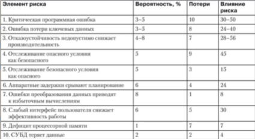
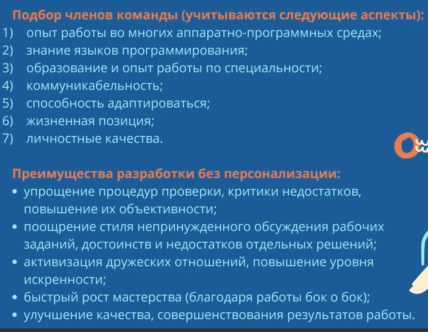
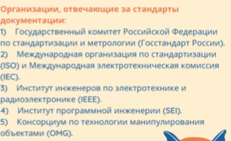
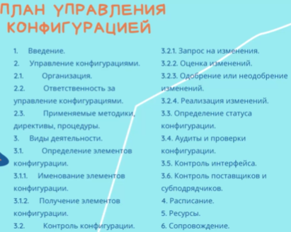

Управление рисками
========================
Риск - возможность опасности или неудачи. 

RE = P(UO)xL(UO), где RE - Показатьель риска (Risk Exposure), P(UO) - вероятность неблагоприятного исхода, L(UO) - потери при срабатывании риска

Управление риском:
- Идентификация риска
- Анализ риска
- Ранжирование риска
- Планирование управления риском
- Разрешение риска
- Наблюдение риска

## Категории источников риска:
### Проектный риск
- Определение бюджета
- построение плана
- Планирование времени
### Технический риск 
- Трудности проектирования 
- конструирования
- риск технического характера
- неточность спецификации
- Техническая неопределенность
### Комерческий риск
- Создание продукта не требующегося на рынке.
- Создание опередающего или отстающего от рынка
- потеря финансирования

Может составлятся таблица для оценки рисков. Два пути: экпертная оценка или предыдущий опыт.

На основании оценки можно ранжировать риски, для определения наиболее важных. Рекомндуется распределение 80 на 20. 80% риска приходится на 20% объема. Анализ рисков может стать причиной для остановки проектов при превышении критических значений.
Правилло Паретта - отслеживание 10 самых важных рисков. Порядок работы:
1. Составление ранжированного списка рисков. Выбор 10 самых критичных.
2. Переодический отсмотр проекта
3. Анализ в первую очередь связанную с 10 выделенными рисками
4. Переанализ важных рисков. Понизившие ранжирование, можно уделить меньше влияние, а новые или повышенные требуют повышенного анализа.

## Риск управления персоналом
### Составление команды
Важным элементом является составление эфективной команды. 
- Опытной в предметной области
- сплоченность
- Гибкость
- Дополнения по навыкам

Команде желательно "кристализоваться" - Когда команда в сумме сильнее чем ее члены по отдельности.

Сплоченную командунадо подирать с психологической сходимостью и поддерживать ее сплоченость.

В противополжность есть идея построения команды без персонализации.

### Взаимодействия в команде
Параметры влияющие на взаимодействию:
- размер команды - связи в команде растут в геометрической прогрессии. Для больших команд рекомендуется разделения на меньшие. Разделение на группы по частям проекта. 
- Иерархия команд - В равноуровневых командах общение более своподно. В сложной иерархии это может быть запутано.
- Рабочее окружение - Организация рабочего места. 

## Управление документацией
Управление документацией ориентированно на поддержание ее полноты и согласованности. Полнота подразумевает, что комплект документации должен охавтывать весь жизненный цикл ПО. Согласованность означает, что комплект документов не содержит внутренних противоречий. На документацию надо выделять достаточно времени. 

Следовать стандартам необязательно, но это сильно усложнит жизнь в последствии.

Документация не должна быть слишком избыточной. Изменения возможны изменения. РЕкомендуется применения механизма гиперссылок. А так же уметь отображать изменения в связанных документах, например создание новых версий.

## Управление конфигурацией
Это координация различных версий и частей програмного кода и документации. Является защитной деятельностью и действует на протяжении всего ЖЦ. 

Включает в себя следующие действия
- идентификация изменений
- контроль изменений
- гарантию правильной реализации
- формирования сообщения о изменениях

Категории отслеживания изменений:
- Компьютерные программы в виде исполняемых кодов
- Документы описывающие программы
- структуры данных

Совокупность всех элементов информаци, вырабатывемых как часть процесса разработки ПО, называют конфигурацией ПО.

### Идентификация объектов в конфигурации ПО
Идентифицирующие типы объектов:
- базисные объекты - элемент информации, создаваемый в ходе анализа, проектирования, кодирования, тестирования
- составной объект - коллекция базисных объектов и других составных объектов

Описание объекта - перечень элементов данных, определяющих:
- тип элемента
- идентификатор проекта
- информация о изменении, версии

### Контроль версий
Набор процедур для контроля и управления версиями объектов конфигурации, которые создаются в ходе разработки.

Типовой план управления конфигурацией

