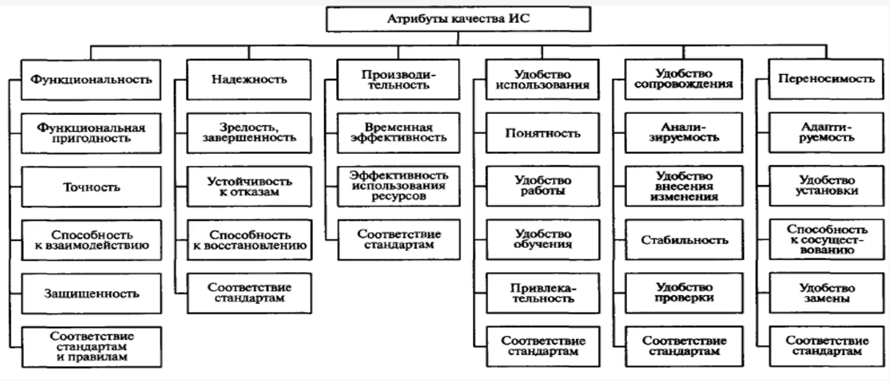

Note 2025-09-06 10h11s46
========================

Отличаются два вида деятельности:
1. Операционная
2. Проектная

Отличие проектной деятельности от операционной:
1. ограниченность в ресурсах (время, ресурсы, объёмы проекта)
2. уникальность финального продукта
3. Наличие большого количества рисков
4. Наличие большого количества изменений
5. Формирование команды для проекта (зачастую)

Проект - это ограниченное по времени мероприятие целью которого является получение нового товара, услуги и тд

Ролевые группы и роли:
- Управление программой (program management)
- Архитектура продукта (architecture)
- Разработка (development)
- ...

Информационная система - среда обеспечивающая целенаправленную деятельность организации. Т.е. она представляет собой процедуры, персонал, програмное и аппаратное обеспечение.

Бизнес-требования к информации:
- результативность
- эффективность
- конфидециальность
- целостность
- доступность
- согласованность
- надежность

Информационная система имеет разные определения, но преподавалтель предпочитает определение включающее человеческий фактор.

Системный подход - методология изучения (рассмотрения) системы как целостнонго стьруктурированного комплекса взаимосвязанных и взаимодействующих элементов для достижения поставленных целей в динамично изменяющемся окружении.

###Основные понятие:
Проектировкание ИС - это процесс создания *описания* достаточного для создания ИС в заданных условиях. Проектирование заклбчается в выполнении комплекса работ по преобразованию исходного описания в виде технического задание в окончатильное описание в виде проекта.

Проектное решение - это описание или оценка проектируемого объекта или его части, достаточного для принятия решения об окончании.

Информационная система - это совокупность технических, програмных, информационных, математических, организационных, технологических, правовых и лингвистических средств, объеденённых в единый комплекс в целях реализации информационных процессов - сбора, хранения, преобразования, передачи, обработки, поиска и выдачи информации, необходимой для пользователей системы.

