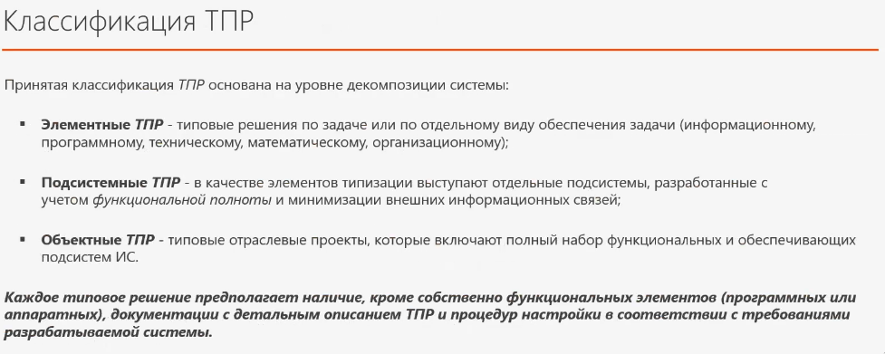
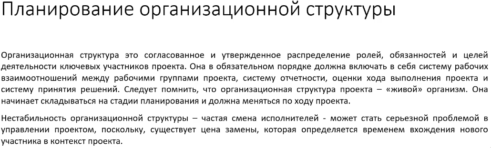
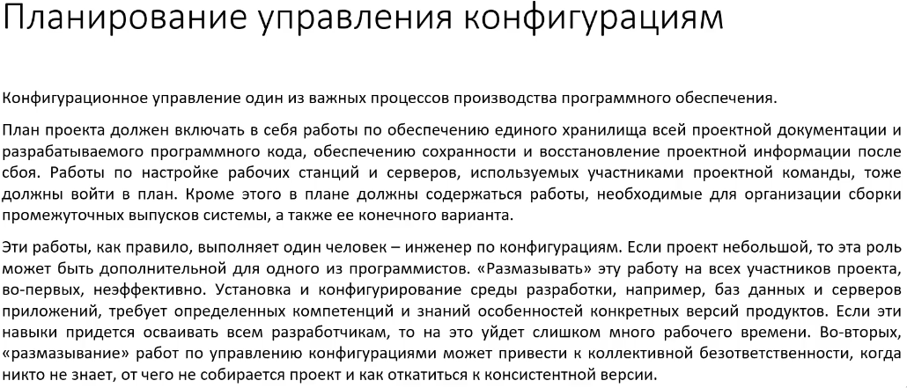

Note 2025-09-20 09h59s48
========================

Эскизный проект - разработка предварительных системных решений.

Технический проект - это набор документации, содержащая общесистеменое описание, алгоритмы работы, схемы бд и финансовый расчёт.

ГОСТ 34.201-2020 Информационная технология. Комплекс стандартов на автоматизированные системы.

ГОСТ Р 59795 - 2021

## Типовое проектирование

Два подхода при типовом проектировании: Параметрически-ориентированный и модельно-ориентированное

## Требования

## Проект

