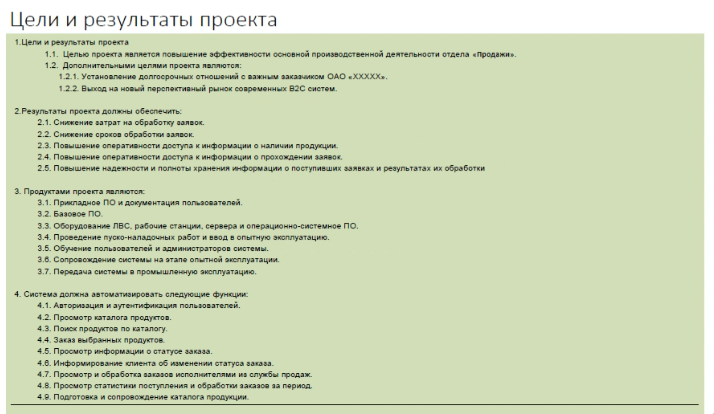
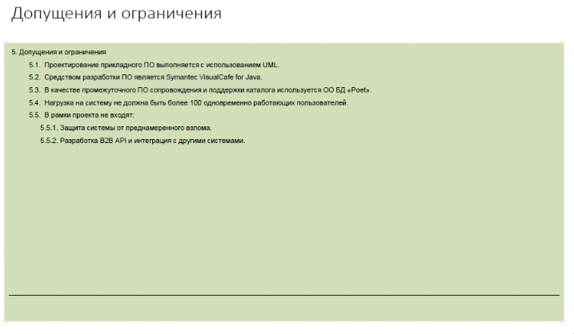
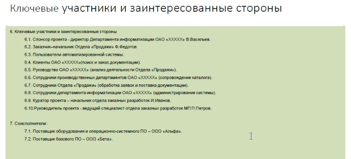
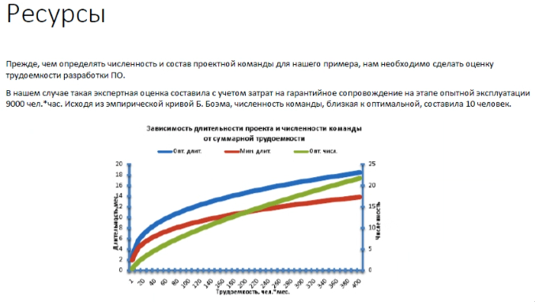
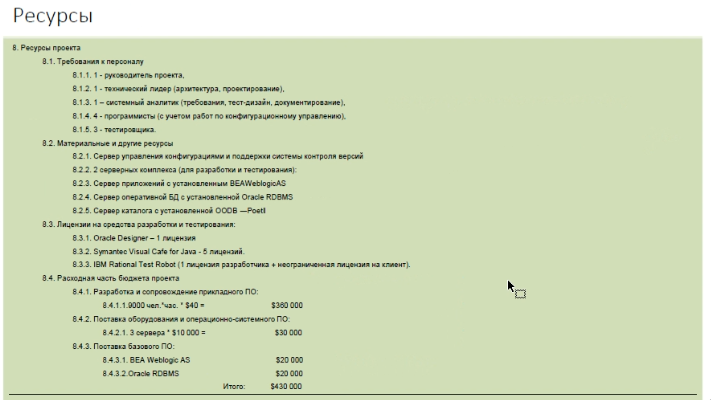
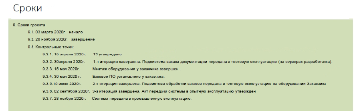
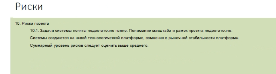
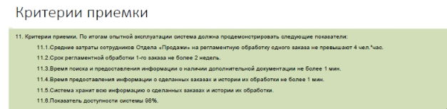
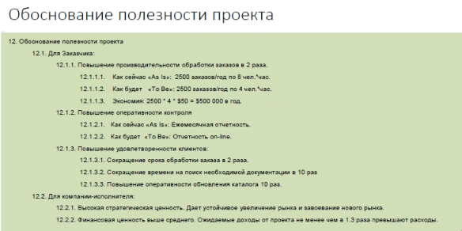
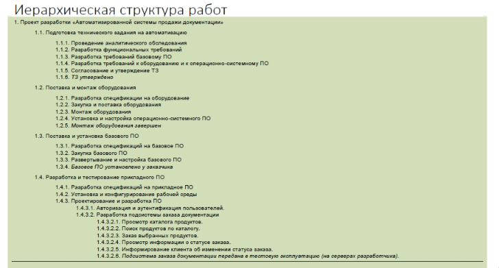

ДЗ
========================

План или устав проекта

Поставить бизнес задачи связанную с разработкой информационной системы.
начиная с концепции и до рисков на уровне предварительного обследования.

Карточку для как минимум одного риска..

Отчёт в ворде практическое задание: разработки плана системы по ...

до 01.12 на почту