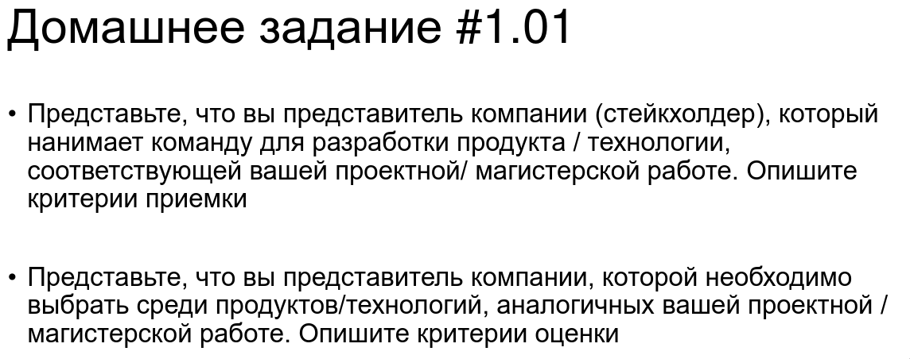

дз 1
========================

## Опишите критерии приёмки как стейкхолдер для разработки

Составь критерии приёмки продукта. Продуктом является документно-реляционная база данных. Это база данных которая сочетает в себе возможность работы с неструктурированными данными, присущая документным базам данных и высокий уровень поддержания конситентности и транзакционности, свойственные реляционным базам данных. База данных должна быть распределённой и подддерживать горизонтальное расширение.

Для составления критериев пользуйся следующим планом для составления критериев.
1. Шаг 1: Определите цель задачи
Прежде чем начинать работу над задачей, необходимо четко определить цель задачи и то, что ожидается от конечного результата. Это поможет определить, какие критерии приемки будут необходимы. Уточните у заказчика, какой результат ожидают пользователи этой фичи.
«Задача будет выполнена, если пользователь сайта на экране оформления заказа может выбрать оплату онлайн»
2. Шаг 2: Определите требования
Следующий шаг - определить требования, которым должен удовлетворять конечный продукт по результату выполнения задачи. Это могут быть требования к функциональности, производительности, безопасности, масштабируемости и т.д. Ответьте на вопросы:
- будут ли в рамках задачи добавлены новые сущности или интеграции? нужна ли для этого отдельная документация?
- нужны ли дополнительные проверки скорости работы нового функционала?
3. Шаг 3: Определите критерии приемки
На основе требований теперь необходимо определить критерии приемки. Критерии приемки должны быть ясными, конкретными и измеримыми. Они должны быть связаны с требованиями и отражать то, что ожидается от конечного продукта. Избегайте обтекаемых, общих формулировок. Плохой вариант: "Задача выполнена в соответствии с требованиями", а правильный: "При переходе на страницу оформления заказа посетитель среди способов оплаты видит онлайн оплату".
4. Шаг 4: Определите процедуру приемки
Можно договориться о процедуре приемки для всех задач заранее, но правильнее проходить этот шаг для каждой конкретной задачи. Нет смысла закреплять функцию приемки для всех задач только за владельцем продукта или менеджером проекта. Очень частно критерием приемки будет технический блок, в принятии которого поможет архитектор, тех-лид или участник команды. Для истории можно указать ответственного за приемку, чтобы через 2-3 спринта/месяца обсудить детали приемки при возникновении вопроса. Это поможет избежать недопонимания и конфликтов в будущем.
5. Шаг 5: Определите процедуру приемки
Не менее важным является определение процедуры приемки. Это может включать в себя определение сроков и места проведения приемки, а также процедуры тестирования и оценки продукта. Зачем здесь сроки? Иногда приемка задачи может быть пройдена через некоторое время после релиза, если требуется время для накопления данных.
6. Шаг 6: Задокументируйте критерии приемки
Наконец, необходимо задокументировать критерии приемки и процедуру, чтобы они были доступны всем заинтересованным сторонам. Документация или список критериев должны быть ясными и понятными, должны быть указаны все детали процедуры приемки и критерии, которые будут использоваться. Здесь встречается частая ошибка, когда команды обсуждают критерии приемки и пытаются их запомнить. Не нужно запоминать, нужно зафиксировать в задаче
7. Завершение
Общий совет - важно не забывать о цели задач, проекта и требованиях к конечному продукту при определении критериев приемки. Критерии приемки должны быть достаточно жесткими, чтобы гарантировать качество продукта, но в то же время должны быть реалистичными и выполнимыми.

## Цели и задачи системы
1. Хранить и обрабатывать неструктурированные (документные) данные с возможностью добавления описания их структуры.
2. Выполнять транзакции (атомарно, согласованно, изолированно, надёжно) над документами для которых описана структура хранения.
3. Поддержка запросов на SQL и api для scala
4. Гарантировать распределённую согласованность данных и отказоустойчивость системы при работе в кластере.

## Определение требований
### Функцональные требования

1. Поддержка хранения неструктурированных данных в виде JSON документов.
2. Возможность описания структуры для коллекций JSON документов.
3. Поддержка ограничений для поддержания целостности для коллекций с описанной структурой.
4. Возможность комбинированных запросов — выполнение SQL-запросов, включающих как табличные данные, так и элементы документов.
5. Поддержка ACID-транзакций для операций над структурированными данными 
6. Возможность определения схемы данных (schema-on-write) и работы без фиксированной схемы (schema-on-read).
7. Наличие API для выполнения запросов на SQL и библиотека для подключения на scala.
8. Средства резервного копирования и восстановления данных, включая распределённые кластеры.
9. Встроенная система контроля версий схемы, миграций и метаданных.

Для выполнения данных требований потребуется подробная документация способов хранения таблиц и файлов, методов исполнения CRUD операций на ними, обеспечения консистентности транзакий. А для обеспечения  корректности работы API потребуется сделать наборы тестов для SQL и scala проверяющие операции работы с данными.

### ️ Требования к архитектуре и масштабируемости

1. Поддержка горизонтального масштабирования в виде распределения целых коллекций на серверах кластера.
2. Обеспечение репликации между узлами (master-master или master-slave) с возможностью автоматического переключения при сбое.
3. Поддержка распределённых транзакций за счёт подтверждения неблокируемости и завершаемости процессов при помощи моделирования с помощью сетей Петри.
4. Возможность динамического добавления и удаления узлов кластера без остановки работы.

Для выполнения требований масштабируемости и архитектуры потребуется описать  документации алгоритмы работы транзакий, способы рапределения данных в кластере и синхронизацию измерений между кластерами.

###  Требования к производительности

1. СУБД должна обеспечивать обработку не менее 10 000 транзакций в секунду при стандартных параметрах кластера.  
2. Средняя задержка ответа на запрос к смешанным данным (табличным + документным) не должна превышать 2× задержки запроса только к табличным данным.
3. Поддержка кэширования запросов, индексов и документных структур.

В рамках данных требоаний нужны дополнительные проверки скорости работы нового функционала, а именно нагрузочные тесты с замером производительности при различных сценариях (чтение, запись, транзакции, масштабирование).

###  Требования к безопасности

1. Механизмы аутентификации и авторизации пользователей и сервисов.
2. Аудит всех операций изменений данных и конфигурации.
3. Возможность разграничения прав доступа на уровне таблиц, документов и атрибутов.
Для корректности работы этих требований потребуется реализовать автотестирование аудитов операцй, механизмов аутентификаций и корректности работы разграничения прав.

## Критерии приёмки
1. Критерий: Система принимает и сохраняет JSON-дкументы без предварительного объявления схемы (schema-on-read).
Проверка: При отправке валидного JSON-документа через API система сохраняет его без ошибок и возвращает уникальный идентификатор документа.
2. Критерий: Для коллекции можно задать схему (schema-on-write), после чего система отклоняет документы, не соответствующие этой схеме. 
Проверка: После регистрации схемы коллекции, попытка вставить JSON-документ с нарушением схемы приводит к ошибке  и описанием нарушения.
3. Критерий: Система поддерживает определение ограничений (например, `NOT NULL`, `UNIQUE`, `CHECK`) для полей коллекций со схемой. 
Проверка: Попытка вставить документ, нарушающий определённое ограничение, приводит к отклонению операции с соответствующим сообщением об ошибке.
4. Критерий: Все операции над коллекциями со схемой выполняются в рамках ACID-транзакций. 
Проверка: При выполнении нескольких операций (вставка, обновление, удаление) в одной транзакции, либо все изменения применяются, либо ни одно — даже при принудительном завершении процесса на этапе применения.
5. Критерий: Распределённые транзакции завершаются консистентно даже при отказе одного из узлов. 
Проверка: После инициации распределённой транзакции, отключения одного из узлов и восстановления его работы, система гарантирует, что транзакция либо полностью применена на всех узлах, либо отменена на всех.
6. Критерий: Система поддерживает выполнение SQL-запросов, включающих как реляционные данные, так и поля из JSON-документов. 
Проверка: Выполненный SQL-запрос, содержащий JOIN между табличными данными и JSON-полем (например, `SELECT t.id, d.value FROM table t JOIN documents d ON t.doc_id = d.id WHERE d.data->>'status' = 'active'`), возвращает корректный результат.
7. Критерий: Предоставляется клиентская библиотека для Scala, позволяющая выполнять CRUD-операции и SQL-запросы к базе.
Проверка: Примеры операций на scala с использованием библиотеки, представленные в документации,  выполняет вставку, выборку, обновление и удаление данных в соотвествии с тест кейсами.
9. Критерий: Система ведёт историю версий схем коллекций и позволяет откатываться к предыдущей версии. Проверка: После изменения схемы коллекции, вызов операции отката схемы на предыдущую версию успешно применяется и документы начинают распознаватся в соответсвии со старой схемой.
10. Критерий: Метаданные (схемы, ограничения, права доступа) реплицируются и согласованы во всех узлах кластера. 
Проверка: После добавления ограничения на одном узле, запрос метаданных на любом другом узле возвращает обновлённую информацию в течение 1 секунды.
11. Критерий: Данные коллекции автоматически распределяются между узлами кластера.
Проверка: При добавлении создании коллекции на одном из серверов, добавляемый файл располагается на сервере с этой коллекцией и синхрониируемый файл попадает на сервер с этой коллекцией.
12. Критерий: При выходе из строя узла, система автоматически переназначает его реплики на другие узлы без потери доступности.
Проверка: После остановки одного узла, система продолжает принимать запросы на чтение и запись на сервере реплики в другом кластере.
14. Критерий: Система обрабатывает не менее 10 000 транзакций в секунду на кластере из 3 узлов (стандартная конфигурация: 4 vCPU, 16 ГБ RAM, SSD).
15. Проверка: Результаты нагрузочного теста YCSB подтверждают устойчивую пропускную способность от 10 000 транзакций в секунду.
16. Критерий: Система кэширует результаты запросов и индексы, обеспечивая ускорение повторных запросов не менее чем в 2 раза.
Проверка: Второй и последующие запуски идентичного запроса выполняются за двое меньший срок исполнения.
17. Критерий: Только аутентифицированные пользователи могут выполнять операции с данными.
Проверка: Запрос без токена аутентификации возвращает ошибку.
19. Критерий: Все операции изменения данных и конфигурации записываются в журнал аудита с указанием пользователя, времени, типа операции и затронутых объектов.
20. Проверка: После выполнения операций INSERT, UPDATE, DELETE через API, запись об этой операции появляется в аудит-логе в течение 1 секунды.
20. Критерий: Система поддерживает создание полной резервной копии распределённого кластера без остановки работы.  
Проверка: Во время выполнения `BACKUP` операции система продолжает обрабатывать запросы, а результирующий архив содержит все данные, существовавшие на момент завершения резервного копирования.
21. Критерий: Система позволяет восстановить данные из резервной копии в новый или существующий кластер с сохранением согласованности и целостности данных.
Проверка: После восстановления из резервной копии все коллекции, схемы, ограничения и данные соответствуют состоянию на момент создания бэкапа; все ACID-свойства сохранены, а результаты выборки совпадают с эталоном.
22. Критерий: Предоставляется полная техническая документация, включающая:
    - описание формата хранения таблиц и JSON-документов,
    - спецификацию API (включая SQL-диалект и Scala-библиотеку),
    - архитектурное описание механизмов репликации, распределения данных и выполнения транзакций,
    - руководство по развертыванию, масштабированию и обновлению кластера.
    Проверка: Все разделы документации присутствуют в формате Markdown/PDF/HTML и прошли внутренний аудит на полноту и точность (подтверждено актом проверки).
23. Критерий: Для всех функциональных и производительных требований существуют автоматизированные тесты (unit, integration, e2e, нагрузочные).
Проверка: Тестовый пакет запускается в CI/CD и покрывает ≥90% требований из разделов «Функциональные требования», «Производительность» и «Безопасность»; все тесты проходят успешно на последней версии системы.
### Процедура приёмки
Приёмка будет распределена между нескольими специалистами для повышения качества проведения проверок и снижения нагрузки на владельца продукта. Распределение сделано следующим образом:
   - Владелец продукта: отвечает за проверку соответствия функциональных и нефункциональных требований.
   - Архитектор/Тех-лид: отвечает за проверку архитектурных и технических аспектов, включая масштабируемость, производительность и безопасность.
   - Команда качества (QA): отвечает за проведение тестирования и подтверждение соответствия продукта критериям приёмки.

Приёмка продукта будет проводится в три этапа. Первый будет проведён после завершения разраотки и внутреннего тестирования. Второй будет проведён после проведения доработок по результатам первой приёмки. Среди наиболее ожидаемых доработок первого этапа являются оптимизация производительности. При успешном прохождении второй приёмки продкут будет выпущен в релиз. Дополнительно, будет проведён третий раунд приёмки через две недели после выхода в эксплуатацию. 

Процедура тестирования и оценки включает комплексный подход к проверке качества продукта. Проводятся автоматизированные unit, integration и e2e тесты для проверки функциональных требований, а также нагрузочное тестирование с профилем, имитирующим реальную нагрузку, для подтверждения соответствия производительности требованиям. Выполняется проверка безопасности, включая тесты на проникновение и аудит кода. Критерии приёмки, не покрытые автоматическими тестами, проходят ручную проверку владельцем продукта и командой QA. После развертывания в продакшн проводится анализ логов, метрик производительности и пользовательского фидбека.

Фиксация результатов приёмки осуществляется через составление детального отчёта о проведении приёмки, в котором указывается соответствие продукта критериям приёмки по каждому пункту, выявленные проблемы и недочёты, если таковые имеются, а также рекомендации по доработке или дополнительному тестированию при необходимости. Завершающим этапом является подписание акта приёмки продукта владельцем продукта, архитектором/тех-лидом и представителем команды QA.

## Опишите критерии оценки как клиентская сторона
При выборе Документно-реляционной базы данных будуn учитываться несколько критериев. 

Во-первых, стоимости владения, учитывая не только прямые расходы на лицензии и инфраструктуру, но и косвенные затраты на обучение команды, развёртывание и поддержание системы.

Во-вторых, я буду оценивать масштабируемость и производительность решения, чтобы убедиться, что оно может эффективно обрабатывать данные и масштабироваться. Для этого надо будет оценить время работы и нагрузки систем в предоставляемых бенчмарках.

Также я буду обращать внимание на гибкость модели данных, которую предлагает выбранное решение. Поскольку предполагается использовать для новых разрабатываемых нами решений, то может потребоватся сначала полностью полагаться на фаловое хранилище и только постепенно вводить структуризацию данных по мере понимания целей их использования.

Немаловажным фактором является безопасность и управление доступом. Будет сравниваться, обеспечивает ли выбранное решение надлежащий уровень защиты данных и позволяет ли гибко управлять правами доступа для различных пользователей.

Кроме того, будут проверяться совместимости решения с существующей инфраструктурой и технологическим стеком, а также оцениваться легкость интеграции с другими инструментами и системами, которые используются.

Финальным фактором для оценки будет являтся сообщество вокруг продукта. Хорошая документация, активное сообщество и качественная поддержка могут существенно упростить внедрение и использование решения. 

На основе оценки продутов по изложенным критериям можно будет выбрать наиболее подходящий продукт для предполагаемых целей использования.